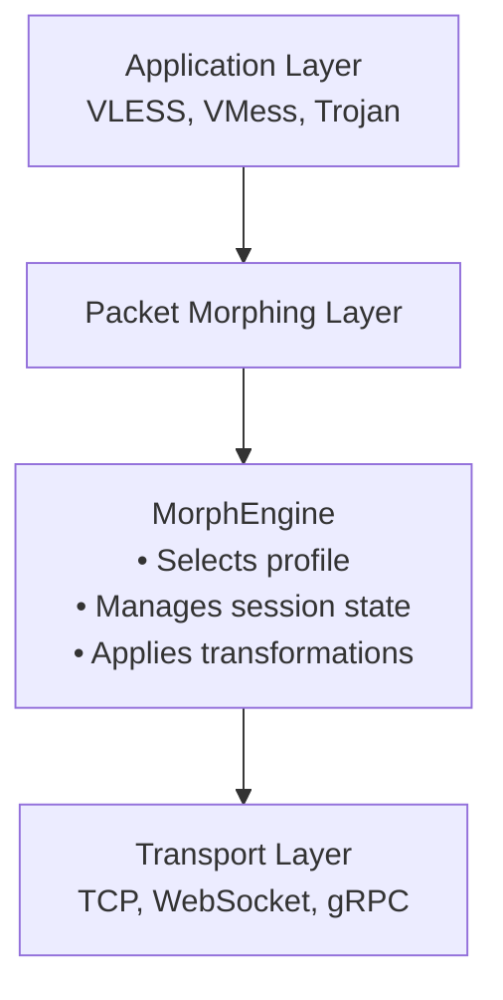

# Packet Morphing

Packet morphing randomizes packet sizes to bypass DPI statistical analysis systems.

## Overview

DPI systems analyze **packet size distributions** as a key detection vector. The TSPU documentation states:

> "Один из ключевых параметров анализа — **размеры пакетов** в рамках сессии и их **вариации**" (Глава 23.1.1)

Packet morphing addresses this by randomizing packet sizes to match natural traffic patterns.

## How It Works



The morphing layer intercepts packets and adjusts their sizes to match predefined profiles of innocent traffic (like YouTube streaming or HTTPS browsing).

## Configuration

### Basic Configuration

Enable morphing in your outbound stream settings:

```json
{
  "protocol": "vless",
  "streamSettings": {
    "network": "tcp",
    "morph": {
      "enabled": true,
      "profile": "dynamic"
    }
  }
}
```

### Configuration Fields

| Field | Type | Description |
|-------|------|-------------|
| `enabled` | boolean | Enable or disable packet morphing |
| `profile` | string | Morphing profile: `"dynamic"`, `"youtube"`, `"https"`, `"video_call"` |
| `adaptive` | boolean | Auto-adjust profile based on traffic type (optional) |
| `seed` | number | Optional seed for reproducible testing (optional) |

### Profile Types

**Dynamic Profile** (Recommended)
- Uses normal distribution for natural-looking packet sizes
- Automatically adapts to different traffic patterns
- Most effective against statistical DPI analysis

**YouTube Profile**
- Emulates YouTube streaming traffic patterns
- Larger packet sizes (1200-1400 bytes) for video chunks
- Regular timing patterns

**HTTPS Profile**
- Emulates standard HTTPS browsing
- Bimodal distribution: small headers + larger data chunks
- Variable packet sizes

**Video Call Profile**
- Emulates WebRTC/Zoom/Meet traffic
- Regular small packets for audio
- Larger packets for video frames

### Example Configurations

**Dynamic morphing** (recommended):
```json
{
  "outbound": {
    "protocol": "vless",
    "streamSettings": {
      "network": "tcp",
      "morph": {
        "enabled": true,
        "profile": "dynamic"
      }
    }
  }
}
```

**YouTube profile**:
```json
{
  "streamSettings": {
    "morph": {
      "enabled": true,
      "profile": "youtube"
    }
  }
}
```

**Adaptive mode**:
```json
{
  "streamSettings": {
    "morph": {
      "enabled": true,
      "adaptive": true,
      "profile": "https"
    }
  }
}
```

## Performance Impact

| Operation | Baseline | With Morphing | Overhead |
|-----------|----------|---------------|----------|
| Small writes | ~100ns | ~150ns | +50% |
| Large writes | ~1μs | ~1.2μs | +20% |
| Throughput | 100% | 95-97% | -3% to -5% |

The performance impact is minimal for most use cases. Bandwidth overhead is typically 5-15% due to padding.

## Technical Details

### Size Selection Algorithm

The dynamic profile uses a normal distribution to generate packet sizes:

```go
// Simplified representation
func selectPacketSize() int {
    // Use normal distribution: μ = 1200, σ = 300
    baseSize := normalDistribution(1200, 300)

    // Add jitter for naturalness
    jitter := randBetween(-50, 50)

    // Clamp to valid range
    return clamp(baseSize + jitter, 200, 1400)
}
```

### Padding Strategy

When a packet needs to be enlarged, realistic padding is added:

```go
// Padding simulates TLS record structure
padding[0] = 0x17  // Application data
padding[1] = 0x03  // TLS 1.2
padding[2] = 0x03
padding[3..4] = length bytes
// Rest: encrypted-looking random bytes
```

This makes the padding resemble actual TLS traffic, reducing the chance of detection.

## Security Considerations

### What Morphing Protects Against

✅ **Statistical DPI analysis** of packet sizes
✅ **Traffic fingerprinting** based on size patterns
✅ **Automated DPI systems** that use size as a key indicator

### Limitations

❌ Does not protect against deep content inspection
❌ Does not provide encryption (use TLS/REALITY for that)
❌ Fixed profiles may become targets over time

### Best Practices

1. **Use dynamic profile** when possible - adapts to traffic patterns
2. **Combine with other obfuscation** (REALITY, WebSocket)
3. **Test in your environment** - effectiveness varies by DPI type
4. **Monitor performance** on low-bandwidth connections

## Troubleshooting

**High CPU usage**
- Check if morphing is enabled on multiple connections
- Consider using a fixed profile instead of adaptive

**Connection failures**
- Some servers may reject oversized packets
- Try reducing the `maxSize` in custom profiles

**Detection still occurs**
- Morphing alone may not be sufficient
- Combine with transport-layer obfuscation (WebSocket, gRPC)

## References

- TSPU Documentation: [Глава 23](/ru/tspu/chapters/23) (Методы обнаружения DPI)
- [Timing Randomization](/ru/tspu/timing-randomization) - Complementary technique
- [User Guide](/ru/tspu/user-guide) - Practical configuration examples
