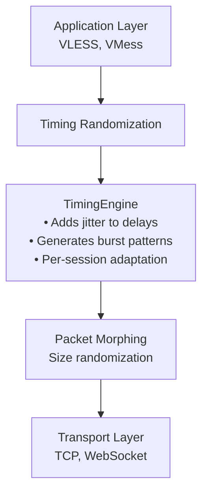
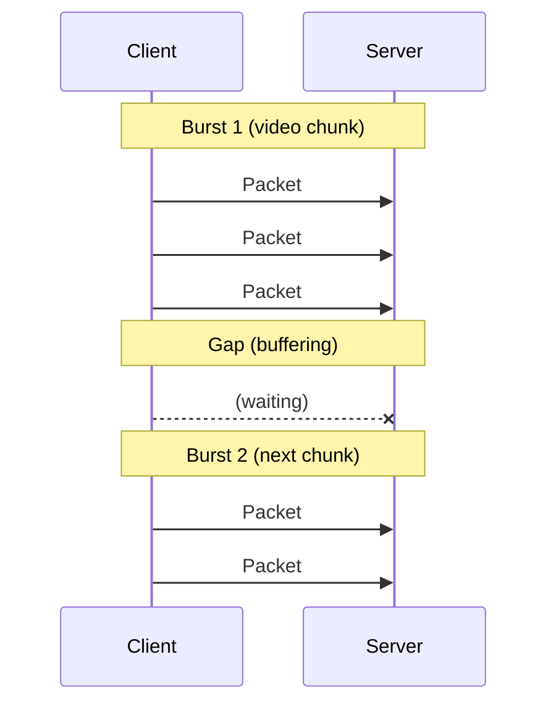

# Timing Randomization

Timing randomization adds realistic jitter to packet timing to break DPI statistical analysis of inter-packet timing patterns.

## Overview

DPI systems analyze **timing patterns** as a key detection vector. The TSPU documentation states:

> "**Частота прохождения пакетов** — ещё один важный параметр" (Глава 23.1.2)
> "Голосовые вызовы генерируют поток пакетов с **регулярными короткими интервалами**" (Глава 23.1.2)

By adding controlled jitter to packet timing, we can make proxy traffic resemble natural network traffic patterns.

## How It Works



### Why Timing Matters

Regular proxy traffic often has **uniform timing patterns** that distinguish it from innocent traffic:

| Traffic Type | Timing Pattern |
|--------------|----------------|
| Proxy traffic | Regular intervals, consistent gaps |
| YouTube streaming | Bursty (video chunks) with variable gaps |
| Web browsing | Interactive: request-response patterns |
| Voice calls | Regular small packets (audio) |

## Configuration

### Basic Configuration

Enable timing randomization in your stream settings:

```json
{
  "protocol": "vless",
  "streamSettings": {
    "network": "tcp",
    "timing": {
      "enabled": true,
      "profile": "dynamic"
    }
  }
}
```

### Configuration Fields

| Field | Type | Description |
|-------|------|-------------|
| `enabled` | boolean | Enable or disable timing randomization |
| `profile` | string | Profile: `"dynamic"`, `"streaming"`, `"interactive"`, `"voice"` |
| `minJitter` | number | Minimum jitter in milliseconds (default: 5) |
| `maxJitter` | number | Maximum jitter in milliseconds (default: 50) |
| `burstEnabled` | boolean | Enable burst patterns (for streaming) |

### Profile Types

**Dynamic Profile** (Recommended)
- Uses Gaussian distribution for natural timing
- Adapts to traffic type automatically
- Best balance of effectiveness and latency

**Streaming Profile**
- Emulates video streaming patterns
- Burst-style packet delivery
- Larger gaps between bursts

**Interactive Profile**
- Emulates web browsing
- Request-response timing patterns
- Lower latency for interactive use

**Voice Profile**
- Emulates VoIP/video calls
- Regular small packets
- Consistent timing intervals

### Example Configurations

**Dynamic timing** (recommended):
```json
{
  "streamSettings": {
    "timing": {
      "enabled": true,
      "profile": "dynamic"
    }
  }
}
```

**Streaming profile**:
```json
{
  "streamSettings": {
    "timing": {
      "enabled": true,
      "profile": "streaming",
      "burstEnabled": true
    }
  }
}
```

**Low-latency interactive**:
```json
{
  "streamSettings": {
    "timing": {
      "enabled": true,
      "profile": "interactive",
      "minJitter": 2,
      "maxJitter": 10
    }
  }
}
```

## Performance Impact

### Latency Overhead

| Profile | Additional Latency | Use Case |
|---------|-------------------|----------|
| Dynamic | 5-25ms per packet | General use |
| Streaming | 10-50ms average | Video, large transfers |
| Interactive | 2-10ms | Web browsing, SSH |
| Voice | 5-15ms | VoIP, calls |

### Throughput Impact

Minimal throughput impact (< 1%) since timing adjustments don't affect data volume.

## Technical Details

### Jitter Distribution

The dynamic profile uses a Gaussian (normal) distribution for natural-looking jitter:

```
          ████
        ██    ██
       █        █
      █          █
    █              █
   █                █
  █                  █
██                    ██
└──────────────────────────
    Min       Mean      Max
    (5ms)    (25ms)     (50ms)
```

Most packets get close to the mean delay, with fewer packets at the extremes.

### Burst Pattern

For streaming traffic, packets are sent in bursts to emulate video chunk delivery:



## Security Considerations

### What Timing Randomization Protects Against

✅ **Statistical timing analysis** by DPI systems
✅ **Packet interval fingerprinting**
✅ **Automated detection** based on regular timing patterns

### Limitations

❌ Does not hide packet contents (use encryption)
❌ May increase latency for real-time applications
❌ Fixed patterns may become detectable over time

### Best Practices

1. **Use dynamic profile** for most scenarios
2. **Combine with packet morphing** for better effectiveness
3. **Adjust for your use case** - interactive vs. bulk transfer
4. **Monitor latency** - timing adjustments add delay

## Troubleshooting

**High latency**
- Reduce `maxJitter` value
- Try `interactive` profile instead of `dynamic`
- Disable burst patterns

**Detection still occurs**
- Combine with packet morphing
- Try transport-layer obfuscation (WebSocket, gRPC)
- Consider using REALITY protocol

**Connection instability**
- Some applications may be sensitive to timing changes
- Try lower jitter values
- Use `interactive` profile for sensitive protocols

## Combining with Packet Morphing

For best results, use both packet morphing and timing randomization:

```json
{
  "streamSettings": {
    "network": "tcp",
    "morph": {
      "enabled": true,
      "profile": "dynamic"
    },
    "timing": {
      "enabled": true,
      "profile": "dynamic"
    }
  }
}
```

This combination addresses both **size** and **timing** detection vectors used by DPI systems.

## References

- TSPU Documentation: [Глава 23](/ru/tspu/chapters/23) (Методы обнаружения DPI)
- [Packet Morphing](/ru/tspu/packet-morphing) - Size randomization
- [User Guide](/ru/tspu/user-guide) - Complete configuration examples
